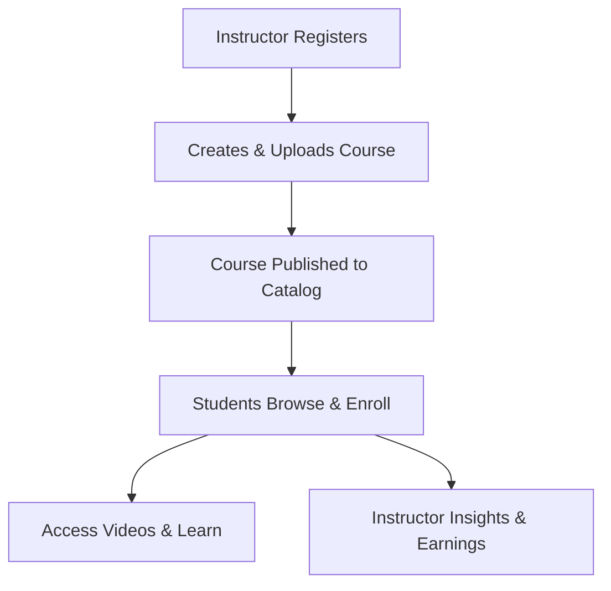

# **Business Use Case – LearnX LMS**

## **1. Purpose**
**LearnX** is a video-first learning platform that connects instructors and learners.  
It focuses on simple course delivery, content discovery, and reliable media access.

---

## **2. Business Use Cases**

| ID | Use Case | Description | Actor |
|:--:|----------|-------------|-------|
| BU-1 | Course Creation | Instructors upload and publish course content and videos. | Instructor |
| BU-2 | Course Discovery | Students browse and search the course catalog. | Student |
| BU-3 | Enrollment & Access | Students enroll and access course content on demand. | Student |
| BU-4 | Learning Delivery | Students watch lessons. | Student |

---

## **3. Business Workflow**

---

## **4. Business Value** 
*(Why this project is useful)*

* **Instructors** upload videos in one click  
* **Students** find and start courses fast  
* **Students** learn anytime on any device  
* **Cloud** keeps videos safe and fast  
* **Works** on phones and laptops  
