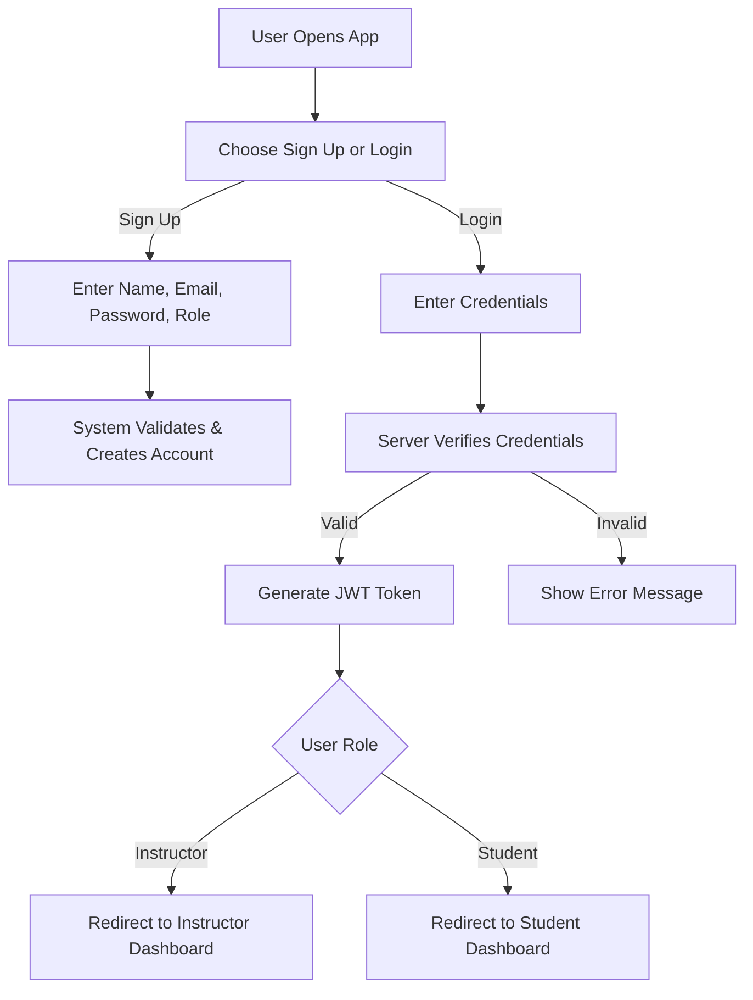
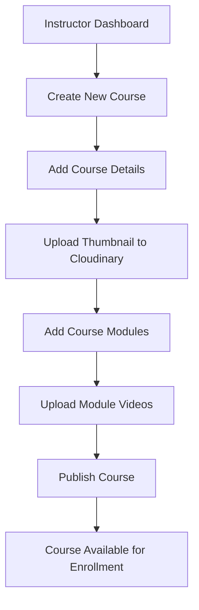
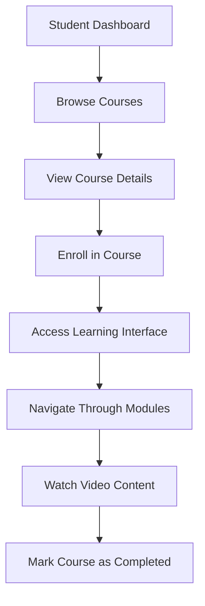
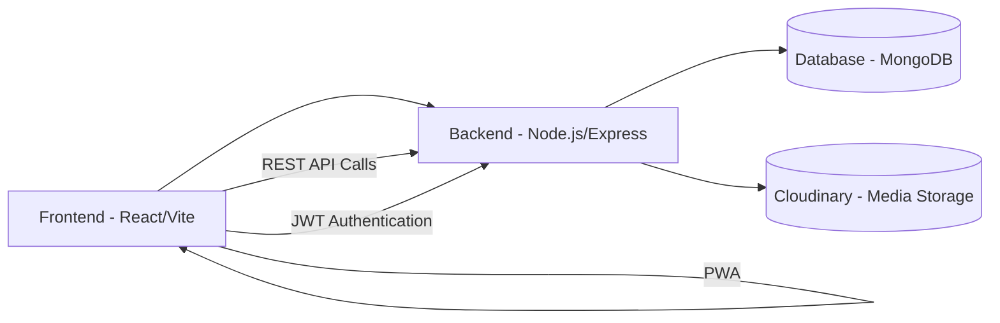

# **Functional Use Case - LearnX LMS**

## **1. Functional Overview**

- Secure login and registration (JWT)
- Role-based dashboards (Instructor / Student)
- Course creation, management, and enrollment
- Video upload & playback (Cloudinary)
- PWA-enabled for mobile access  

| **Module** | **Function** |
|-------------|--------------|
| **Authentication** | Secure login & registration |
| **Courses** | Create & manage course details |
| **Media** | Upload and stream videos |
| **Enrollment** | Students join courses |
| **Dashboard** | Role-based user views |

---

## **2. Functional Flow**

### **I. User Registration & Login**

Shows how users sign up or log in. After validation, a token is generated and they’re redirected to their dashboard based on role.

---

### **II. Course Creation & Management Flow**

Instructors create and manage courses with modules and media uploads.

---

### **III. Student Learning Flow**

Students browse, enroll, and progress through courses with video content.

---

## **3. Core Functional Modules**

| **Module**            | **Functionality**                               |
| --------------------- | ----------------------------------------------- |
| **Authentication**    | Register and login securely using JWT           |
| **Authorization**     | Role-based dashboard redirection                |
| **Dashboard**         | Personalized interface for each user role       |
| **Course Management** | Instructors create, edit, and delete courses    |
| **Media Management**  | Upload and watch videos using Cloudinary       |
| **Enrollment**        | Students browse and enroll in courses           |

---

## **4. Use Case Summary**

| **ID** | **Use Case** | **Action** |
|--------|--------------|------------|
| **F1** | User Registration | Create account with Student/Instructor role |
| **F2** | User Login | Authenticate with email/password |
| **F3** | Course Creation | Instructor creates courses with details |
| **F4** | Module Management | Add/remove course modules with videos |
| **F5** | Course Enrollment | Students enroll in available courses |
| **F6** | Video Learning | Stream module videos |
| **F7** | Progress Tracking | Mark courses as completed |
| **F8** | File Uploads | Upload thumbnails and videos to Cloudinary |

---

## **5. System Flow**

Modern web architecture with React frontend and Node.js backend.

---

## **6. Edge Case Handling**

| **Scenario** | **Expected Behavior** |
|--------------|---------------------|
| Invalid credentials | Show error message with validation |
| JWT expired | Auto-redirect to login page |
| Unauthorized access | Redirect to appropriate dashboard |
| Video playback issues | Fallback handling with error states |
| Course deletion with enrollments | Current: Hard delete, Future: Soft delete with archives |

---

## **7. Future Scope**

* **Advanced Analytics** - Detailed progress tracking and learning insights
* **Payment Integration** - Paid course enrollment system
* **Discussion Forums** - Student-instructor interactions
* **Assessment System** - Quizzes and assignments
* **Mobile App** - Native mobile application
* **Offline Learning** - Downloadable course content
* **AI Recommendations** - Personalized course suggestions