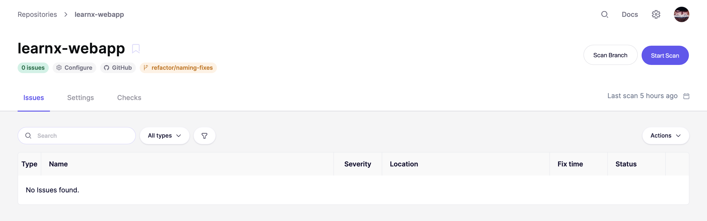
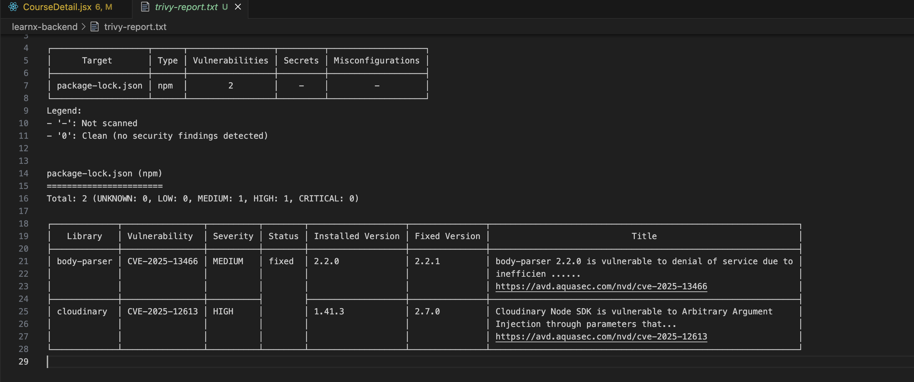
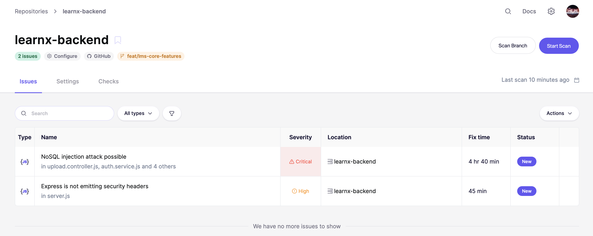

# **SAST - Static Application Security Testing**

**Tools:** Trivy, Semgrep

**Scans:** Source code for vulnerabilities
- SQL injection risks
- Hardcoded secrets
- Unsafe dependencies
- Security misconfigurations

---

## **Frontend SAST Report**

### **Trivy Scan Results - Frontend**

### **Aikido Scan Results - Frontend**

---

## **Backend SAST Report**

### **Trivy Scan Results - Backend**

### **Aikido Scan Results - Backend**

---

## **DAST Status:** Pending backend deployment completion