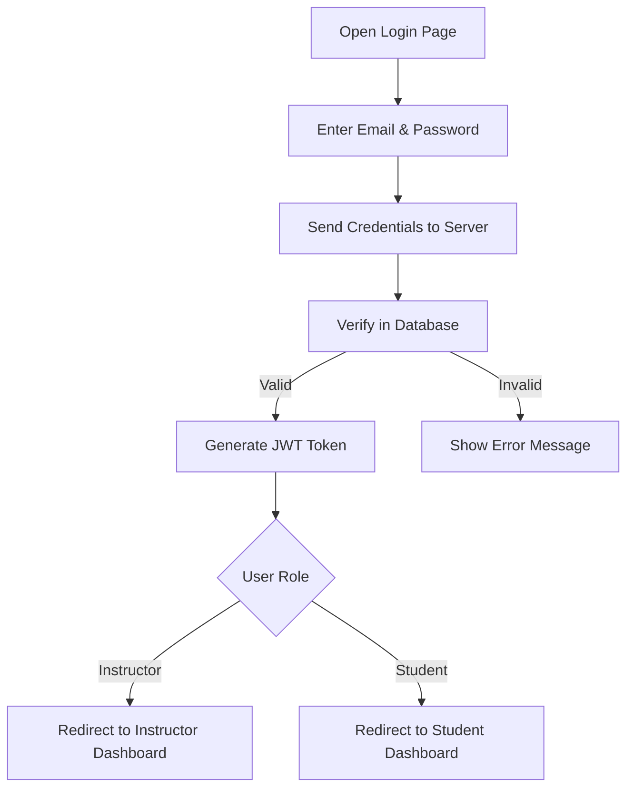
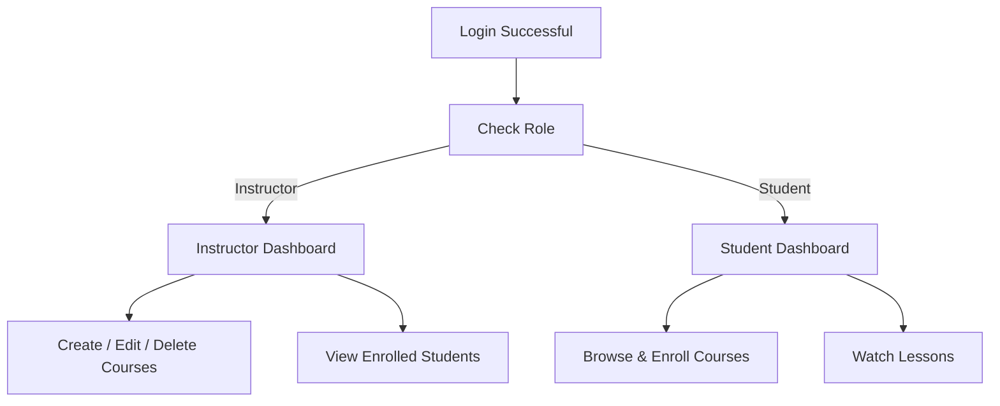
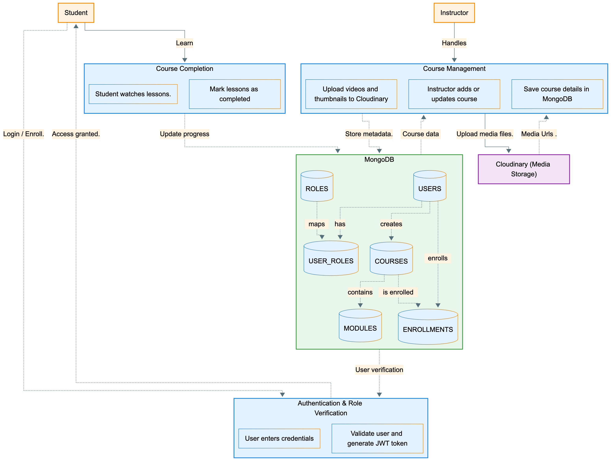

# **Technical Docs - LearnX LMS**

## **1. Architecture Overview (AWS)**

**LearnX** is a role-based Learning Management System (LMS) connecting **Instructors** and **Students** through a secure, scalable web platform.
It follows a modular **MERN stack architecture** for seamless integration and deployment.

## **2. Authentication Flow**

Authentication ensures that only valid **Instructors** and **Students** can access LearnX.
Users log in or sign up using email and password.

**Purpose:**

- Secure user login
- Prevent unauthorized access

---

## **3. Authorization Flow**

After login, the system checks the user’s role and grants access accordingly. Instructors can manage courses, while students can browse, enroll, and watch lessons.

---

## **4. Tech Stack**

| **Layer** | **Logo** | **Technology** | **Version** |
|-----------|----------|----------------|-------------|
| **Programming Language** |  | JavaScript | ES14 |
| **Frontend Library** |  | React | 19.2.0 |
| **CSS Framework** |  | Tailwind CSS | 4.1.17 |
| **Build Tool** |  | Vite | 7.2.2 |
| **Runtime Environment** |  | Node.js | 22.12.0 |
| **Backend Framework** |  | Express | 5.1.0 |
| **Database** |  | MongoDB | 8.0 |
| **Media Storage** |  | Cloudinary | 1.45.0 |
| **Payment Integration (Test)** |  | PayPal SDK | 1.8.0 |
| **Authentication** |  | JWT | 9.0.2 |
| **Mobile Experience** |  | React PWA | Manifest V3 |
| **Cloud Hosting** |  | AWS | Latest |
| **Version Control** |  | GitHub | Latest |

---

## **5. Data Flow Diagram (DFD)**

The Data Flow Diagram (DFD) represents how data flows within the **LearnX LMS** platform. It visually explains how users (students and instructors) interact with the system and how data is processed, stored, and managed across different components.

---

### **DFD Level 0 - Context Diagram**

This level provides an overview of the complete system. It shows how **students** and **instructors** communicate with the **LearnX LMS**, which handles authentication, course management, and media storage using **MongoDB Atlas** and **Cloudinary**.

---

### **DFD Level 1 - System Process Breakdown**

The Level 1 diagram expands the system into key functional processes **Authentication**, **Course Management**, and **Course Completion**. It illustrates how data moves between users, the database, and external services to support secure login, course handling, and student progress.

---

## **6. Testing Plan**

Testing strategy to ensure all features work correctly

| **Area**              | **What to Test**                              | **Test Cases**                                                                 |
|-----------------------|-----------------------------------------------|--------------------------------------------------------------------------------|
| **Login Form**        | User can log in                               | - Valid email + password → login success - Wrong password → show error - Empty field → show error |
| **Registration**      | New user can sign up                          | - Fill all fields → account created - Same email twice → error |
| **Course List**       | Shows courses                                 | - Page shows course cards - Search box finds course by name - No results → "Not found" message |
| **Course Details**    | Shows course info                             | - Title, price, instructor name visible - Enroll button works |
| **Enrollment**        | User can join course                          | - Click Enroll → "You are enrolled" message |
| **Course Creation**   | Instructor adds course                        | - Click Publish → course appears in list |
| **API: Login**        | POST /auth/login                              | - Correct email/password → get token - Wrong password → error |
| **API: Get Courses**  | GET /api/courses                              | - Returns list of courses - Search works |

---

## **7. API Endpoints (Planned)**

### **Authentication APIs**
- `POST /api/auth/register` - User registration
- `POST /api/auth/login` - User login
- `POST /api/auth/logout` - User logout
- `GET /api/auth/me` - Get current user

### **User APIs**
- `GET /api/users/profile` - Get user profile
- `PUT /api/users/profile` - Update user profile

### **Course APIs**
- `GET /api/courses` - Get all courses (with search/filter)
- `GET /api/courses/:id` - Get single course details
- `POST /api/courses` - Create new course (Instructor only)
- `PUT /api/courses/:id` - Update course (Instructor only)
- `DELETE /api/courses/:id` - Delete course (Instructor only)

### **Module APIs**
- `GET /api/courses/:id/modules` - Get course modules
- `POST /api/courses/:id/modules` - Add module to course
- `PUT /api/modules/:id` - Update module
- `DELETE /api/modules/:id` - Delete module

### **Enrollment APIs**
- `POST /api/enroll/:courseId` - Enroll in course (with test payment)
- `GET /api/enroll/my-courses` - Get enrolled courses

---

## **8. Conclusion**

**LearnX LMS** uses secure authentication and role-based authorization to provide:

- Clear separation of **Instructor** and **Student** views
- Safe and scalable system
- Ready for future features like progress tracking and payments
